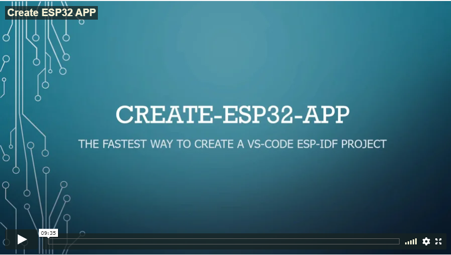

# ESP32 Starter template
>A Simple ESP32 Starter template generator from your command line run

```
npx create-esp32-app
```

You can watch the video by clicking the image link below
[](https://www.learnesp32.com/2_create-esp32-app)

## Quick overview

This template can be used as is but, its intended as a quick start for the students learning the ESP32-IDF through my course [https://learnesp32.com](https://learnesp32.com)

if you want a simple vanilla flavoured template to copy and paste see [esp32-starter](https://github.com/Mair/esp32-starter)


## prerequisites

1. You will need to have [node](https://nodejs.org) installed.
2. The esp-idf must be installed. you can follow the instructions in my course (free of charge) with the "[Setting up Your Environment](https://www.learnesp32.com/2_introduction)" module or follow the [official documentation](https://docs.espressif.com/projects/esp-idf/en/latest/get-started/#step-1-set-up-the-toolchain). The installation will create 2 folders. the esp-idf and the tools folder (usually called .espresif). pay attention to where these folders are as you will need to know there locations

3. this template is for [vscode](https://code.visualstudio.com/download) which will need to be installed
4. In VSCODE add the [c++ extension](https://marketplace.visualstudio.com/items?itemName=ms-vscode.cpptools)

5. ensure tour ESP32 is plugged in and that a COM PORT is established (You may need a driver for your ESP32 dev board)

## Run command

1. in any directory run
```
npx create-esp32-app
```

2. you will be prompted for the name of your project.
3. you will be prompted for the IDF path (esp-idf folder). select or navigate to the location of the IDF path. If you have an environment variable called **IDF_PATH** the path will default to the environment variable.
3. you will be prompted for the IDF-TOOLS path (.espressif folder). select or navigate to the location of the IDF-TOOLS path. If you have an environment variable called **IDF_TOOLS_PATH** the path will default to the environment variable.
4. You will be asked if you like to include additional sample code or other items. Leave blank if you would like a bare-bones project
5. navigate to the directory of the project name you created
```
cd <project name>
```
4. open the project in vscode ```code .```

## vs code intellisense

intellisense should just work so long as you have set up the paths correctly. If you have trouble double check your idf and tools paths and correct them in the **/.vscode/c_cpp_properties.json** file
## flashing the esp32

1. In vs code, open a new terminal by pressing ctrl + \` (or pressing F1 and typing `open new terminal`)
2. The first time you open the terminal. Vscode will ask you to allow permission to run a script. The script in question is the esp-idf import script which imports all the esp-idf environment variables into the shell.
click allow and close the shell by pressing the trash can (not the x) then reopen the terminal again.

3. Type the following command

```bash
idf.py -p [your com port] flash monitor
```

## Contribution
Pull requests are both welcome and encouraged 😃